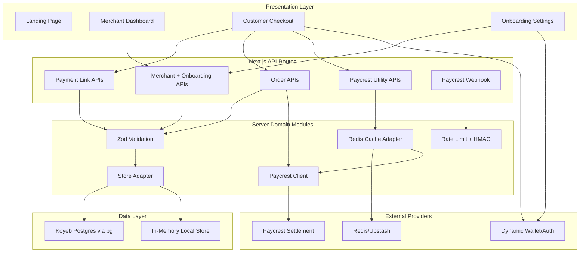
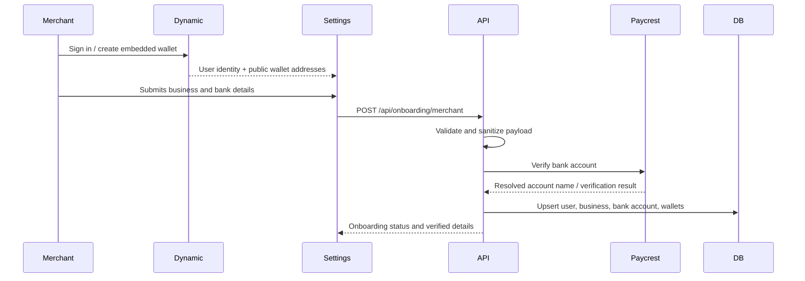
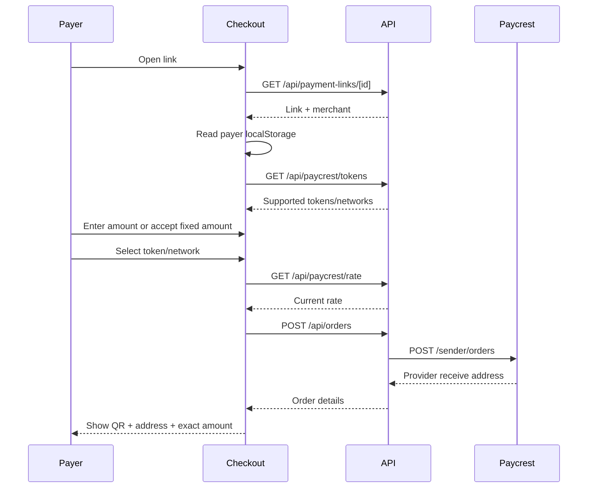
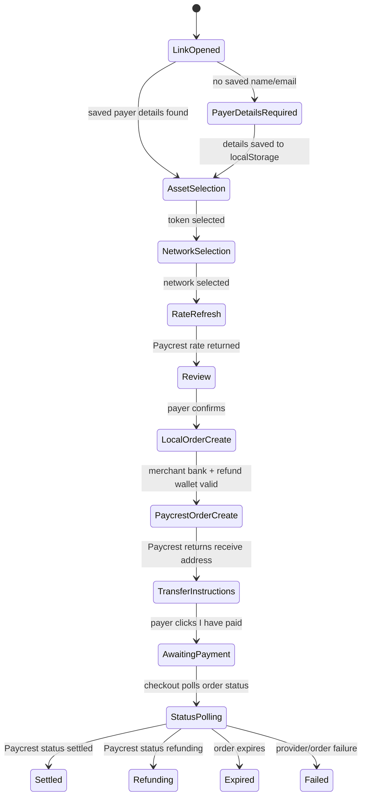
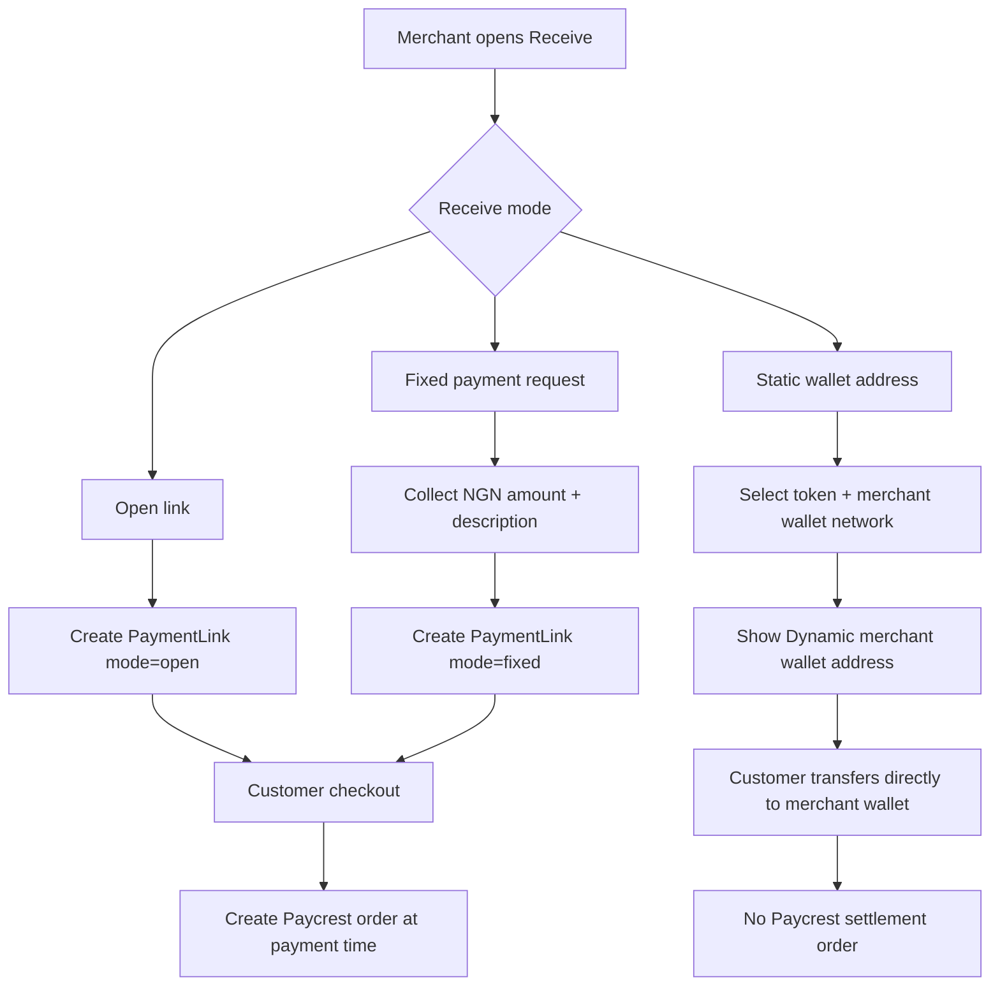
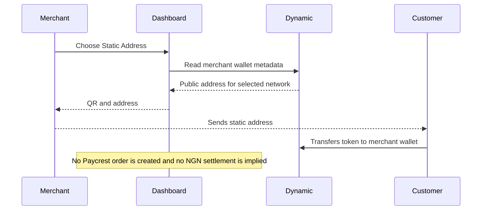
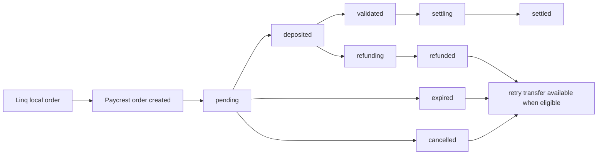
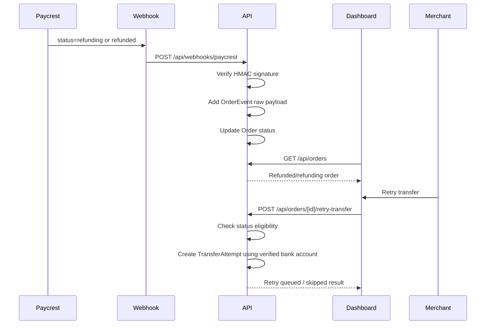
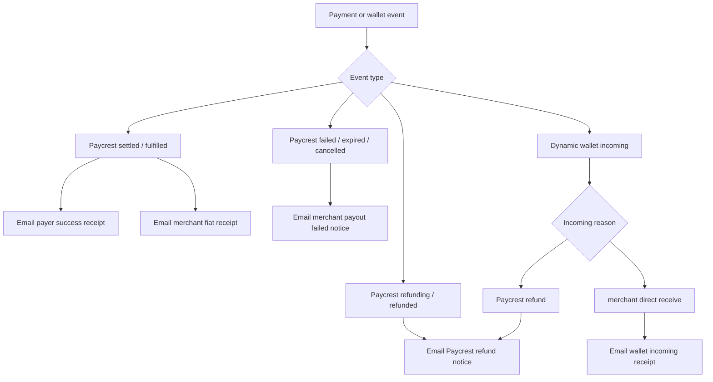

# Linq Architecture and System Design Report

## 1. Executive Summary

Linq is a merchant-first stablecoin payment system for Nigerian businesses. The product lets a merchant sign in, register business and payout details, connect or receive Dynamic-managed wallet addresses, create payment links, receive customer payments in USDT or USDC, and settle value to a verified Nigerian bank account through Paycrest.

The system is built as a Next.js full-stack application. The frontend provides a mobile-first merchant dashboard and customer checkout experience. The backend lives inside the same Next.js app through App Router API routes and is positioned for deployment on Koyeb. The intended production persistence layer is a Koyeb-connected Postgres database accessed through direct SQL and the `pg` client, not Prisma. Redis is used as the cache layer for Paycrest token, network, and rate data. The implementation also contains a local in-memory adapter so the product can be demonstrated without live production credentials.

The most important product rule is custody separation. Merchants control their wallets through Dynamic. Linq stores public wallet metadata, not private keys. For Paycrest payment/request links, Linq creates Paycrest orders and gives the customer the Paycrest receive address. For static receive addresses, Linq does not create a Paycrest order and instead shows the merchant's own Dynamic wallet address.

## 2. Business Goals

Linq exists to make stablecoin acceptance practical for businesses that want NGN settlement. The merchant does not need to manually monitor chains, calculate exchange rates, or reconcile customer messages. A payer opens a link, enters their details once, chooses a supported token and network, and receives exact transfer instructions. The merchant sees the order in the dashboard with payer details, amount, token, network, status, Paycrest reference, and retry controls where applicable.

Primary goals:

- Let merchants onboard with business identity, payout bank, and wallet addresses.
- Keep wallet ownership with the merchant, not the platform.
- Price payment links in NGN and refresh rates at payment time.
- Create local orders before creating Paycrest orders so each payment has an internal audit trail.
- Store payer name and email against the order for merchant reconciliation.
- Cache Paycrest token/network/rate data for 15 minutes.
- Show compact, professional order records in the dashboard.
- Provide a retry transfer action that always targets the already verified bank account.
- Produce a documented architecture that can be shared with engineers, partners, and operators.

## 3. Implementation Status

This report documents the implementation currently present in the repository.

Completed in the current codebase:

- Plain SQL schema for the core production data model in `db/schema.sql`.
- Server modules for environment parsing, validation, Paycrest integration, cache abstraction, API response helpers, webhook security, and local development storage.
- API routes for onboarding, merchant profile, bank verification, Paycrest token/rate utilities, payment links, orders, retry transfer, and Paycrest webhook handling.
- Checkout flow that asks for payer details, saves them locally, fetches supported assets, refreshes rate, creates an order, and shows transfer instructions.
- Dashboard orders page backed by the orders API with expandable details and conditional retry transfer.
- Merchant onboarding component in settings.
- Designed PDF/HTML/Markdown report artifacts.

Important caveat:

- Dynamic is represented by a bridge provider abstraction and local fallback because the `@dynamic-labs/*` packages repeatedly hung during installation in this environment. The bridge is intentionally placed at the app shell so the real Dynamic SDK can be swapped in without changing checkout/onboarding UI contracts.

## 4. High-Level Architecture

Linq uses a layered architecture:

Deployment note: the backend can now be deployed as a separate Dockerized Koyeb service from the `backend/` directory. The Next frontend can call that service's public Koyeb URL for API traffic, while the backend connects to Koyeb Postgres through `DATABASE_URL`.

1. Presentation layer: Next.js App Router pages and React components.
2. Client API layer: typed fetch helpers in `src/lib/api-client.ts`.
3. Backend API layer: Next.js route handlers under `src/app/api`.
4. Server domain layer: modules under `src/server`.
5. Persistence layer: Koyeb Postgres through direct SQL in production, local store fallback for development.
6. External providers: Paycrest, Dynamic, Redis.



## 5. Runtime Modes

Linq is designed to run in two modes.

### 5.1 Local/Demo Mode

Local mode is used when live provider credentials are missing. In this mode:

- Paycrest calls return deterministic fixture data.
- Redis cache falls back to an in-memory cache.
- Koyeb database access is not required if `DATABASE_URL` is absent.
- Merchant, bank, wallet, link, order, event, and transfer data are served from the local store.
- Dynamic bridge returns demo embedded wallet addresses.

This mode is useful for design review, checkout demos, and integration UI testing.

### 5.2 Production Mode

Production mode activates when environment variables are present:

- `DATABASE_URL` enables direct Postgres access for the Koyeb-hosted backend.
- `PAYCREST_API_KEY` enables live Paycrest requests.
- `PAYCREST_WEBHOOK_SECRET` enables strict webhook signature verification.
- `UPSTASH_REDIS_REST_URL` and `UPSTASH_REDIS_REST_TOKEN` enable Redis-backed caching.
- `NEXT_PUBLIC_DYNAMIC_ENV_ID` enables real Dynamic SDK integration once the SDK packages are installed.

Production mode must be treated as real-money infrastructure because Paycrest settlement touches live payment rails.

## 6. Merchant Onboarding

Merchant onboarding collects identity, business, bank, and wallet information.

Inputs:

- Dynamic user id.
- User email and name.
- Business name.
- Merchant name.
- Business email.
- Optional business location.
- Bank institution code.
- Bank account identifier.
- Optional institution name and account name.
- Wallet list from Dynamic.

Flow:



Key design decisions:

- The backend only stores wallet public addresses and metadata.
- Paycrest account name is preferred over user-submitted account name when verification returns a match.
- Wallet sync can be repeated as merchants add or rotate wallets.
- Onboarding status reflects the strongest completed step: started, bank verified, wallet synced, or complete.

## 7. Payment Link Modes

Linq supports three link modes.

### 7.1 Open Payment Link

An open link lets the payer enter the amount. It is useful for flexible invoices, donations, custom work, or customer-entered totals.

Behavior:

- No fixed amount is stored on the link.
- Checkout requires payer amount before order creation.
- Rate is fetched at payment time.
- Paycrest order is created after payer selects token and network.

### 7.2 Fixed Payment Request

A fixed request locks the NGN amount when the merchant creates the link.

Behavior:

- `amountNgn` is stored on the payment link.
- Checkout displays the locked NGN amount.
- Payer cannot edit the amount.
- Rate is still recalculated at payment time so the stablecoin amount reflects the latest market rate.

### 7.3 Static Wallet Address

A static link is not a Paycrest order. It displays a merchant-controlled Dynamic wallet address.

Behavior:

- No Paycrest order is created.
- No Paycrest receive address is shown.
- No automatic NGN settlement is implied.
- The payer must send the selected token to the merchant's public wallet address.

This distinction is important because static wallet links are fundamentally different from Paycrest settlement links.

## 8. Checkout Flow

Checkout is designed for a payer who may not have used Linq before. The flow keeps the UI short while still collecting enough information for merchant reconciliation.

Flow:

1. Payer opens `/pay/[id]`.
2. Checkout fetches payment link and merchant details.
3. Checkout checks `localStorage` for saved payer name/email.
4. If missing, checkout asks for name and email before crypto selection.
5. Checkout fetches Paycrest-supported tokens and networks from the backend.
6. Payer selects USDT or USDC.
7. Payer selects a Paycrest-supported network.
8. Backend refreshes rate for NGN to selected stablecoin.
9. Payer reviews merchant, payer, token, network, and rate.
10. Backend creates a local order.
11. Backend creates a Paycrest order.
12. Checkout shows exact token amount, receive address, QR code, order status, and expiry if present.
13. Payer clicks "I have paid" after sending funds.
14. Dashboard continues status reconciliation through polling and webhooks.



### 8.1 Order Creation State Flow



### 8.2 Receive Link Mode Decision Flow



### 8.3 Static Receive Flow



## 9. Paycrest Integration Design

The Paycrest integration is centralized in `src/server/paycrest.ts`.

Responsibilities:

- Build authenticated requests with `API-Key`.
- Fetch supported tokens from `/tokens`.
- Fetch market rates through `/rates/{network}/{token}/{amount}/{fiat}`.
- Fallback to provider rate bands through `/provider/rates/{token}/{fiat}` if needed.
- Verify bank accounts through `/verify-account`.
- Create crypto-to-fiat orders through `/sender/orders`.
- Normalize Paycrest statuses into internal order statuses.
- Return deterministic local fixtures if live credentials are absent.

Paycrest order payload pattern:

```json
{
  "amount": "50000",
  "amountIn": "fiat",
  "rate": "1500",
  "reference": "cp-reference",
  "source": {
    "type": "crypto",
    "currency": "USDT",
    "network": "base",
    "refundAddress": "merchant_wallet_address"
  },
  "destination": {
    "type": "fiat",
    "currency": "NGN",
    "recipient": {
      "institution": "GTBINGLA",
      "accountIdentifier": "1234567890",
      "accountName": "ACME MARKET LIMITED",
      "memo": "Linq cp-reference"
    }
  }
}
```

Rate strategy:

- The merchant creates links in NGN.
- The checkout requests the latest rate for the selected token/network/amount.
- The backend computes `cryptoAmountDue = amountNgn / marketRate`.
- Paycrest may return its own `amount`, `rate`, `senderFee`, and `transactionFee`; those returned values become the source of truth on the stored order.

### 9.1 Paycrest Order Lifecycle



### 9.2 Refund and Retry Flow



Caching strategy:

- Supported tokens and market rates are cached for 900 seconds.
- Redis is preferred in production.
- Memory cache is used in local mode.
- Cache keys include network, token, amount, and fiat currency so token/network choices do not collide.

## 10. Dynamic Wallet Design

Dynamic is responsible for authentication and wallet ownership. Linq does not manage merchant private keys.

Intended production behavior:

- Merchant signs in with Dynamic.
- Dynamic creates or lists embedded wallets.
- The frontend reads public wallet addresses through Dynamic hooks.
- The frontend syncs those public addresses to Linq backend.
- The backend stores network, chain, address, wallet id, wallet type, and token support.

Current implementation behavior:

- `DynamicBridgeProvider` wraps the app shell.
- It exposes `enabled`, `connected`, `user`, `wallets`, `connect`, and `disconnect`.
- If Dynamic env is absent, it uses deterministic demo wallets.
- Once the Dynamic SDK package install is available, this bridge should be replaced internally with real SDK calls while preserving the public bridge shape used by the app.

Security posture:

- Never request, log, store, or transmit private keys.
- Treat wallet address records as public-but-sensitive merchant routing metadata.
- Validate wallet address length and format server-side before persistence.
- Keep static receive links separate from Paycrest settlement links.

## 11. Data Model

The plain SQL schema in `db/schema.sql` is the production database contract. Prisma is intentionally not used.

### 11.1 User

Purpose: maps Dynamic identity to Linq ownership.

Fields:

- `id`: internal UUID.
- `dynamicUserId`: unique Dynamic user id.
- `email`: merchant email.
- `name`: optional display name.
- `role`: merchant or admin.
- `createdAt`, `updatedAt`: audit timestamps.

Relationships:

- One user owns one `MerchantBusiness`.

### 11.2 MerchantBusiness

Purpose: stores merchant business profile and onboarding status.

Fields:

- `businessName`: public business name shown at checkout.
- `merchantName`: operator or owner name.
- `email`: business email.
- `location`: optional display location.
- `onboardingStatus`: started, bank verified, wallet synced, complete.

Relationships:

- Has many wallets.
- Has many bank accounts.
- Has many payment links.
- Has many orders.

### 11.3 MerchantWallet

Purpose: stores public wallet routing metadata.

Fields:

- `chain`: chain family such as evm.
- `network`: Paycrest/network id such as base or polygon.
- `address`: public receive/refund address.
- `walletId`: optional Dynamic wallet id.
- `walletType`: embedded or external.
- `tokenSupport`: JSON list of supported stablecoins.

Uniqueness:

- Business, network, and address must be unique together.

### 11.4 BankAccount

Purpose: stores the verified NGN payout destination.

Fields:

- `institutionCode`: Paycrest institution code.
- `institutionName`: human-readable bank name when known.
- `accountIdentifier`: account number or provider identifier.
- `resolvedAccountName`: verified Paycrest account name.
- `verificationStatus`: pending, verified, failed.

Security:

- Retry transfer uses this stored account only.
- Dashboard copy should make it clear that retries use the verified bank account to reduce fraud risk.

### 11.5 PaymentLink

Purpose: stores merchant-created checkout surfaces.

Fields:

- `slug`: public link id.
- `mode`: open, fixed, or static.
- `amountNgn`: required for fixed links.
- `description`: optional memo.
- `status`: active, paused, archived.

Behavior:

- Open and fixed links can create Paycrest orders.
- Static links show merchant wallet addresses and do not create Paycrest orders.

### 11.6 Order

Purpose: central transaction record for payment links.

Fields:

- `payerName`, `payerEmail`: captured before crypto selection.
- `amountNgn`: merchant-denominated amount.
- `token`: USDT or USDC.
- `network`: selected Paycrest-supported network.
- `quotedRate`: NGN per token.
- `cryptoAmountDue`: exact token amount requested.
- `senderFee`, `transactionFee`: Paycrest-returned fee values where available.
- `paycrestOrderId`: external Paycrest reference.
- `providerReceiveAddress`: address Paycrest gives the payer.
- `validUntil`: expiry when Paycrest returns it.
- `status`: normalized order state.
- `paycrestPayload`: raw provider payload for audit/debug.

### 11.7 OrderEvent

Purpose: append-only audit log.

Examples:

- `order.created`
- `paycrest.webhook.received`
- `order.settled`
- `order.refunded`

Each event stores source, event name, raw payload, and timestamp.

### 11.8 TransferAttempt

Purpose: records merchant-triggered retry attempts.

Fields:

- `attemptNumber`: sequential attempt count per order.
- `status`: requested, created, failed, skipped.
- `paycrestReference`: external retry reference when available.
- `resultPayload`: raw result.
- `errorMessage`: failure reason.

## 12. API Surface

### 12.1 `POST /api/onboarding/merchant`

Purpose: create/update merchant business, verify bank, and store wallet metadata.

Validates:

- Dynamic user id.
- User and business emails.
- Business and merchant names.
- Bank institution code.
- Account identifier.
- Wallet address records.

Returns:

- Merchant record.
- Bank verification result.

### 12.2 `GET /api/merchant/me`

Purpose: return active merchant and payment links for dashboard rendering.

Current local behavior:

- Returns seeded merchant when auth is not configured.

Production expectation:

- Resolve merchant from authenticated Dynamic session.

### 12.3 `POST /api/bank/verify`

Purpose: verify account correctness through Paycrest.

Controls:

- Rate limited by client IP.
- Zod validates institution code and account identifier.
- Returns resolved account name if available.

### 12.4 `GET /api/paycrest/tokens`

Purpose: return Paycrest-supported stablecoins and networks.

Controls:

- Optional `network` query.
- Cached for 15 minutes.
- Local fallback returns USDT/USDC fixtures for base, polygon, arbitrum-one, and bnb-smart-chain.

### 12.5 `GET /api/paycrest/rate`

Purpose: return the current NGN rate for token/network/amount.

Query:

- `network`
- `token`
- `amountNgn`

Returns:

- `marketRate`
- optional minimum and maximum rate bounds.
- cache TTL metadata.

### 12.6 `POST /api/payment-links`

Purpose: create open, fixed, or static payment links.

Validation:

- Fixed links must include `amountNgn`.
- Mode must be open, fixed, or static.
- Description is length-limited.

### 12.7 `GET /api/payment-links/[id]`

Purpose: fetch a public link and merchant profile for checkout.

Returns:

- Link metadata.
- Merchant business metadata.
- Merchant wallets and bank records needed for checkout decisions.

### 12.8 `POST /api/orders`

Purpose: create local order and Paycrest order.

Rules:

- Static links are rejected.
- Fixed links use the stored link amount.
- Open links require payer amount.
- Merchant must have a verified bank account.
- Merchant must have a suitable refund wallet for the selected token/network.
- Paycrest order is created after local validation.

### 12.9 `GET /api/orders`

Purpose: list merchant orders for dashboard.

Returns:

- Orders with transfer attempts.

### 12.10 `GET /api/orders/[id]`

Purpose: fetch a single order by internal id or Paycrest id.

Used by:

- Checkout status polling.
- Dashboard detail refresh.

### 12.11 `POST /api/orders/[id]/retry-transfer`

Purpose: queue a payout retry for eligible orders.

Eligible statuses:

- failed
- refunded
- expired
- cancelled

Non-eligible statuses return conflict and create a skipped attempt record.

### 12.12 `POST /api/webhooks/paycrest`

Purpose: receive Paycrest order status events.

Controls:

- Optional strict HMAC verification when webhook secret is configured.
- Raw payload is logged to `OrderEvent`.
- Order status is normalized and updated.

## 13. Security and OWASP API Considerations

### 13.1 Input Validation

All write routes use Zod schemas. The schemas trim whitespace, constrain length, normalize emails, restrict network identifiers, validate token choices, and bound NGN amounts.

Examples:

- Email max 254 characters.
- Token enum restricted to USDT and USDC.
- Network format restricted to lowercase alphanumeric and hyphen.
- Amount must be positive and below 100,000,000 NGN.
- Institution codes use uppercase alphanumeric/hyphen format.

### 13.2 Authentication and Authorization

Current local implementation uses seeded merchant context. Production should bind `GET /api/merchant/me`, payment link creation, order listing, and retry actions to the authenticated Dynamic user.

Production requirement:

- Verify Dynamic session/token server-side.
- Resolve `dynamicUserId`.
- Query the merchant business owned by that user.
- Reject access to other merchants' resources.

### 13.3 Rate Limiting

The current implementation adds in-memory rate limiting for public bank verification and order creation.

Production recommendation:

- Move rate limits to Redis or edge middleware.
- Use route-specific thresholds.
- Include bot detection on public checkout endpoints.

### 13.4 Webhook Integrity

Webhook verification uses HMAC SHA-256 with timing-safe comparison when `PAYCREST_WEBHOOK_SECRET` exists.

Production recommendation:

- Require the secret in production.
- Reject unsigned webhooks.
- Store webhook id if Paycrest provides one to enforce idempotency.
- Log signature failures separately for alerting.

### 13.5 Sensitive Data

Do not store:

- Wallet private keys.
- Seed phrases.
- Dynamic recovery secrets.
- Paycrest API secrets in client bundles.

Do store:

- Public wallet addresses.
- Verified payout account metadata.
- Paycrest order references.
- Audit payloads needed for reconciliation.

### 13.6 Error Handling

API responses use a consistent envelope:

```json
{
  "ok": false,
  "error": {
    "message": "Invalid request data.",
    "details": {}
  }
}
```

This keeps client handling predictable and avoids leaking stack traces.

## 14. Dashboard Design

The dashboard is intentionally compact and business-focused.

Orders show:

- Payer name.
- Payer email.
- NGN amount.
- Token.
- Network.
- Status.
- Internal order id.
- Paycrest order id.
- Rate.
- Created date.
- Provider receive address.
- Retry action when eligible.

The order list avoids large decorative cards and keeps repeated information dense enough for business scanning. Expandable details let merchants inspect a transaction without leaving the page.

## 15. UI and Animation Design

The checkout bottom sheet previously relied on utility classes that were not reliably animating. It now uses Framer Motion for:

- Overlay fade.
- Sheet slide-up.
- Sheet exit animation.

This is appropriate because payment UX needs transitions to feel intentional. The animation is short and functional, not decorative.

Network icons were removed from network selection areas. Network rows now use names and compact initials, while USDT/USDC token icons remain visible. This matches the product requirement that stablecoin identity matters more than network branding in this payment flow.

## 16. Environment Variables

Production variables:

| Variable | Purpose |
| --- | --- |
| `DATABASE_URL` | Koyeb/Postgres connection string |
| `DATABASE_SSL` | Keep `true` for Koyeb database TLS unless explicitly disabled |
| `DATABASE_POOL_MAX` | Maximum direct `pg` pool size, default `5` |
| `PAYCREST_API_KEY` | Paycrest API authentication |
| `PAYCREST_API_URL` | Paycrest base URL, defaults to v2 |
| `PAYCREST_WEBHOOK_SECRET` | HMAC webhook verification secret |
| `NEXT_PUBLIC_DYNAMIC_ENV_ID` | Dynamic environment id for frontend SDK |
| `DYNAMIC_API_TOKEN` | Server-side Dynamic API token if needed |
| `UPSTASH_REDIS_REST_URL` | Upstash Redis REST URL |
| `UPSTASH_REDIS_REST_TOKEN` | Upstash Redis REST token |
| `NEXT_PUBLIC_APP_URL` | Public app URL for generated links |

## 17. Deployment Plan

Recommended deployment path:

1. Provision or attach a Postgres database in Koyeb.
2. Provision Redis or Upstash.
3. Add all environment variables.
4. Run `db/schema.sql` against the Koyeb database.
5. Configure Paycrest API key and webhook URL.
6. Configure Dynamic app and allowed origins.
7. Deploy Next.js app.
8. Run live smoke tests with tiny order value.
9. Verify webhook delivery and dashboard reconciliation.
10. Enable merchant onboarding for real users.

## 18. Testing Plan

### 18.1 Build and Type Safety

Run:

```bash
npm run build
```

Expected:

- Next.js compile succeeds.
- Route handlers typecheck.
- Dashboard and checkout pages build.

### 18.2 Backend Unit Tests to Add

Recommended tests:

- Validation accepts valid onboarding payload.
- Validation rejects invalid email, account identifier, token, network, and amount.
- Paycrest payload builder creates correct crypto-to-fiat order shape.
- Rate conversion calculates `cryptoAmountDue` accurately.
- Webhook signature verification rejects invalid signatures.
- Status normalization maps Paycrest statuses to internal statuses.
- Retry transfer rejects non-eligible statuses.

### 18.3 API Route Tests to Add

Recommended tests:

- `POST /api/onboarding/merchant` stores verified account name.
- `POST /api/bank/verify` rate limits repeated attempts.
- `GET /api/paycrest/tokens` returns cached token list.
- `GET /api/paycrest/rate` returns market rate.
- `POST /api/payment-links` rejects fixed links without amount.
- `POST /api/orders` rejects static links.
- `POST /api/orders` rejects merchant without verified bank.
- `POST /api/webhooks/paycrest` updates order status.

### 18.4 Manual Product Tests

Manual test script:

1. Open dashboard settings.
2. Submit onboarding details.
3. Confirm bank verification feedback.
4. Open receive page.
5. Create fixed payment request for 50,000 NGN.
6. Open preview checkout.
7. Enter payer name/email.
8. Select USDT.
9. Select Base.
10. Confirm rate and crypto amount.
11. Create manual transfer order.
12. Confirm QR/address/status show.
13. Click "I have paid".
14. Open orders page.
15. Expand order.
16. Confirm payer details and Paycrest id are visible.

## 19. Receipts, Invoices, PDFs, and Email Notifications

Linq now includes a receipt and invoice notification layer. The purpose is to turn payment events into merchant- and payer-facing documents with clear meaning, so the recipient understands whether money was paid, settled, refunded, failed, or received directly into a merchant wallet.

### 19.1 Receipt Types

| Receipt kind | Audience | Trigger | Meaning |
| --- | --- | --- | --- |
| `payer_transaction_success` | Payer | Paycrest order reaches fulfilled/settled | The payer's transaction went through and has been recorded. |
| `merchant_fiat_received` | Merchant | Paycrest order reaches fulfilled/settled | Fiat value reached the merchant's verified payout flow. |
| `merchant_payout_failed` | Merchant | Paycrest order fails, expires, or is cancelled | Funds remain tracked and the merchant can retry from dashboard. |
| `merchant_paycrest_refund` | Merchant | Paycrest order is refunding/refunded, or wallet webhook marks Paycrest refund | Incoming value is a Paycrest refund, not a new customer direct receive. |
| `merchant_wallet_incoming` | Merchant | Dynamic wallet webhook reports direct incoming funds | Merchant wallet received funds directly outside Paycrest order settlement. |

### 19.2 Receipt Generation

Receipts are generated in two formats:

- HTML email body using the dark Linq report style.
- PDF attachment generated server-side for download and email attachment.

Important routes:

- `GET /api/orders/[id]/receipt?kind=...` returns a designed HTML receipt.
- `GET /api/orders/[id]/receipt.pdf?kind=...` returns a PDF receipt.
- `POST /api/orders/[id]/send-receipt` sends or records a receipt email.

The PDF generator is intentionally dependency-light. It creates a valid one-page PDF buffer server-side so receipt generation can run in API routes without launching a browser.

### 19.3 Resend Email Delivery

Email delivery uses Resend's REST API when `RESEND_API_KEY` is configured.

Required variables:

- `RESEND_API_KEY`
- `EMAIL_FROM` (`Linq <noreply@uselinq.site>` in production)

If Resend is not configured, receipt delivery is recorded as `skipped` with local metadata. This keeps development safe while proving the document generation path.

### 19.4 Notification Flow



### 19.5 Dashboard Controls

Expanded order rows now expose:

- Open receipt PDF.
- Email payer receipt.
- Email merchant invoice/notice.
- Retry transfer when eligible.

Receipt sends are idempotent per order, kind, audience, and recipient, so repeated webhooks or repeated button clicks do not spam the same receipt.

## 20. Known Gaps and Next Engineering Steps

The implementation is structurally ready but there are clear next steps before real production use:

- Install and wire the real Dynamic SDK packages once package installation is unblocked.
- Replace local store reads/writes with direct SQL repository functions using `src/server/db.ts`.
- Keep future schema changes as SQL migration files under `db/`.
- Add server-side Dynamic token verification.
- Move in-memory rate limiting to Redis.
- Add webhook idempotency key storage.
- Add test suite for validation, Paycrest client, route handlers, and status transitions.
- Add admin visibility for failed webhook attempts.
- Add clearer production observability: logs, metrics, alert thresholds, and reconciliation jobs.
- Add a persistent `Receipt` repository implementation once direct SQL repositories replace the local store.

## 21. Appendix: Current File Map

Important files:

- `backend/Dockerfile`: standalone Docker entrypoint for Koyeb backend deployment.
- `backend/src/index.ts`: standalone HTTP server that exposes the Linq API routes.
- `backend/src/server/*`: copied backend domain modules for the standalone service.
- `backend/db/schema.sql`: Koyeb/Postgres schema included in the backend deploy folder.
- `db/schema.sql`: production data model for Koyeb/Postgres.
- `src/server/db.ts`: direct `pg` database pool helper for Koyeb.
- `src/server/env.ts`: environment parsing and live-mode flags.
- `src/server/validation.ts`: request schemas and sanitization.
- `src/server/paycrest.ts`: Paycrest adapter.
- `src/server/receipts.ts`: receipt/invoice renderer, PDF generation, Resend email delivery, and notification routing.
- `src/server/pdf.ts`: lightweight server-side PDF writer.
- `src/server/cache.ts`: Redis/memory cache abstraction.
- `src/server/security.ts`: rate limiting and webhook signature verification.
- `src/server/store.ts`: local demo store and repository-like helpers.
- `src/app/api/*/route.ts`: backend API endpoints.
- `src/components/checkout/PaymentCheckout.tsx`: customer checkout flow.
- `src/components/onboarding/MerchantOnboarding.tsx`: merchant setup form.
- `src/components/providers/DynamicBridgeProvider.tsx`: Dynamic integration bridge.
- `src/app/dashboard/transactions/page.tsx`: compact order list and retry UI.

## 22. Completion Evidence

The current implementation has been verified with:

```bash
npm run build
```

The build passed after the backend routes, checkout flow, dashboard, Koyeb SQL schema, and report artifacts were added.
